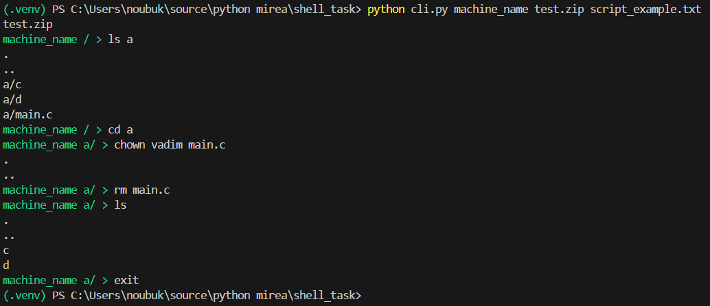

# Домашнее задание №1 по конфигурационному управлению
## Разработать эмулятор для языка оболочки ОС.
Необходимо сделать работу эмулятора как можно более похожей на сеанс shell в UNIX-подобной ОС.

Эмулятор должен запускаться из реальной командной строки, а файл с виртуальной файловой системой не нужно распаковывать у пользователя.

Эмулятор принимает образ виртуальной файловой системы в виде файла формата zip. 

Эмулятор должен работать в режиме CLI.

Ключами командной строки задаются:
* Имя компьютера для показа в приглашении к вводу.
* Путь к архиву виртуальной файловой системы.
* Путь к стартовому скрипту.

Стартовый скрипт служит для начального выполнения заданного списка команд из файла.

Необходимо поддержать в эмуляторе команды ls, cd и exit, а также следующие команды:
1. rev.
2. rm.
3. chown.
   
Все функции эмулятора должны быть покрыты тестами, а для каждой из поддерживаемых команд необходимо написать 2 теста.

## Установка и запуск

### 1. Клонирование:

```bash
git clone https://github.com/nopeg/shell_task
```

### 2. Имя компьютера

Введите любую строку, которая будет использоваться, как имя компьютера
    
    - machine_name: Название компьютера пользователя

### 3. Путь к архиву виртуальной файловой системы

Введите путь к .zip архиву. В репозитории имеется тестовый архив __test.zip__

    - zip_file_path: Путь к архиву с файловой системой

### 4. Путь к стартовому скрипту

Введите путь к .txt скрипту. В репозитории имеется файл с тестами скриптов __script_example.txt__

    - script_file_path: Путь к стартовому скрипту
    
### 4. Запуск приложения

```bash
python cli.py machine_name test.zip script_example.txt
```

## Команды эмулятора

Приложение поддерживает следующие команды:

    - ls: отобразить содержимое текущего каталога.
    - cd <path>: сменить текущий каталог.
    - rev <filename: отобразить содержимое файла в обратном порядке.
    - rm <path>: удаление файлов или директорий.
    - chown: изменяет владельца и/или группу для указанных файлов.
    - exit: выйти из эмулятора.

## Примеры и тесты


